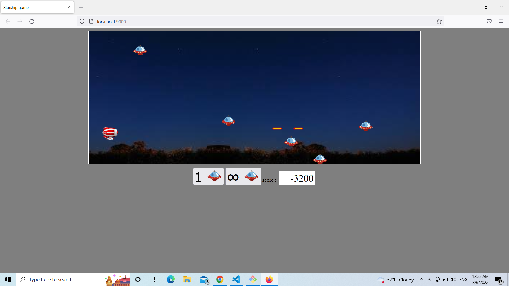

# In the starship folder i will present StarShip Game :

### The folder contains :

1. the folder **src** , is the folder contains the code source (.js files).

## Steps before start the game :

* should create **node_modules** that manipulate the models , to install it , open a terminal in tp-starship location and write this command :

    * ` npm install ` 

* after that should the first bundle **dist** folder , to create it write this command in tp-starship location :

    * `npm run build `

### To run the game should open terminal in tp-starship directory and run the command:

* ` npm run dev-server `  

### Enjoy the game !!

knnlnn

  build:
    runs-on: ubuntu-latest
    steps:
      - uses: actions/checkout@v2
      - uses: actions/setup-java@v1
        with:
          java-version: 11
      - uses: sonarsource/sonarqube-scan-action@v1.1.0
        with:
          # The URL of your local SonarQube server
          sonarqube-host-url: http://localhost:9000
          # The token used to authenticate with the SonarQube server
          sonarqube-token: ${{ secrets.SONARQUBE_TOKEN }}

